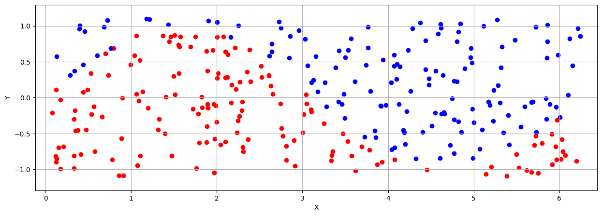
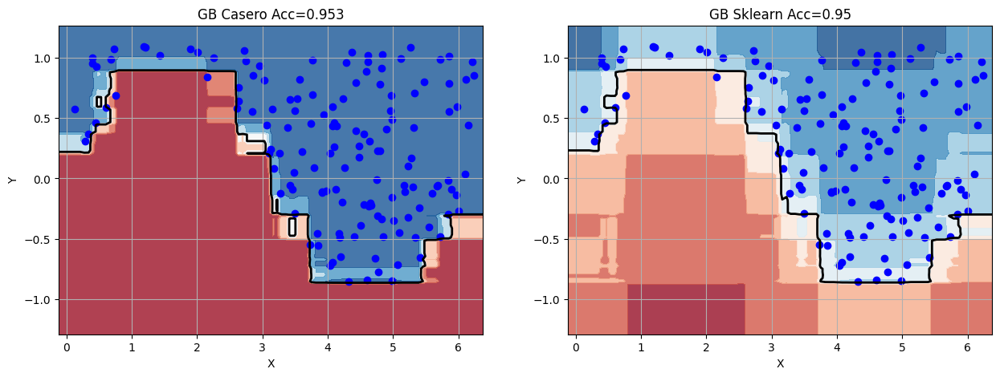
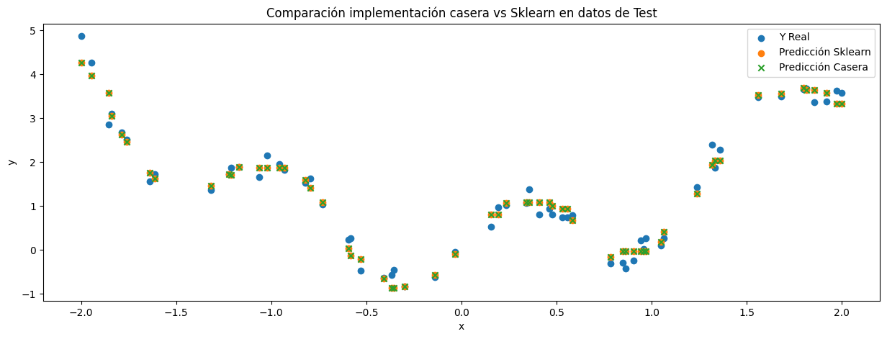

# Gradient Boosting Implementation

This project features an implementation of the Gradient Boosting algorithm, an ensemble method that combines multiple decision trees (stumps). It utilizes gradient descent optimization to minimize the loss function. The collective contributions of all weak models (stumps) result in a robust predictive model.

## Key Concepts
1. **Sequential Learning**: Models are built sequentially, each correcting the errors of its predecessor.
2. **Gradient Descent**: Optimizes the model by minimizing the loss function using gradient descent.
3. **Weak Learners**: Typically, decision stumps are used as the weak learners, which are simple models that perform slightly better than random guessing.
4. **Additive Model**: The final model is an additive combination of the weak learners.
5. **Loss Function**: The choice of loss function depends on the type of problem (mean squared error for regression and log loss for classification).

## Self Implementation  vs. Sklearn Implementation
Both implementations yield similar results for classification and regression tasks.

### Classification:
- **Ground Truth:**  
  

- **Performance:**  
  

### Regression:
  

